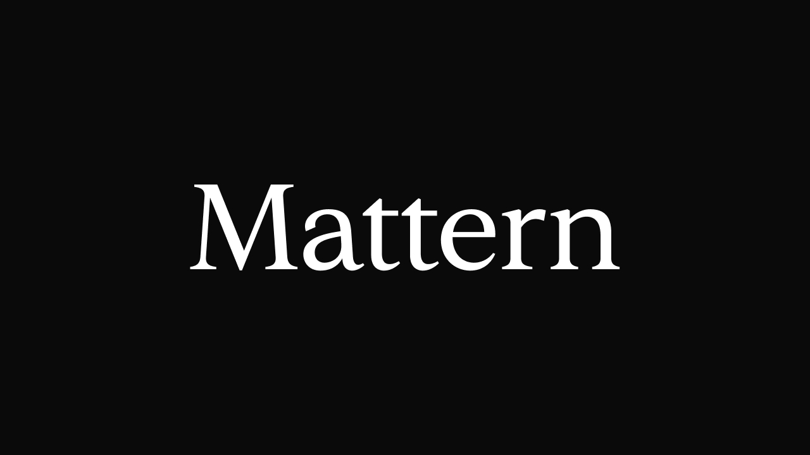

# Mattern

>A refined serif typeface that matters

## About Mattern
Mattern is a serif typeface that was originally designed for headlines, yet it performs well in long text. While it’s based on _Libre Baskerville_ by [Impallari](https://github.com/impallari/Libre-Baskerville), all of Mattern’s glyphs were redrawn from scratch—with a lower x-height, sharper serif tails, and carefully refined proportions, weight, and curves.

The name Mattern comes from "matter" and "pattern". Every detail matters and was carefully crafted to create consistent patterns for comfortable reading.

## Opentype Features

#### Stylistic Sets:
| Example                                    | Set Name | Description                                      |
| -------------------------------------------| -------- | ------------------------------------------------ |
|    | `ss01`   | Alternate “M” with straight vertical stems       |
|    | `ss02`   | Alternate “a” with straight-sided stem           |
|    | `ss03`   | Alternate “g” with single-storey form            |

#### Other features:
- `liga` - Standard ligatures
- `dlig` - Rare ligatures

## License

Mattern Font is licensed under the [SIL Open Font License 1.1](https://github.com/ahmadfawaid/Mattern/blob/main/LICENSE.txt).
You are free to use, modify, and distribute Mattern — including for commercial purposes such as embedding it in a product or service.

However, **YOU MAY NOT SELL** the font or its derivatives by themselves.
If you are interested in commercial licensing beyond what's permitted by the OFL, please [reach out](mailto:ahmadnfwd@gmail.com).

For more details, see the full license text and FAQ at https://openfontlicense.org.

## Author

[Ahmad Fawaid](https://dribbble.com/ahmadfawaid)